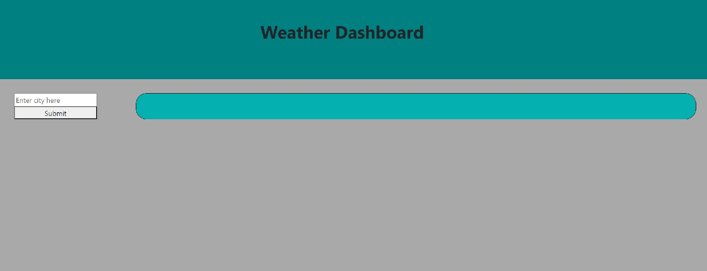
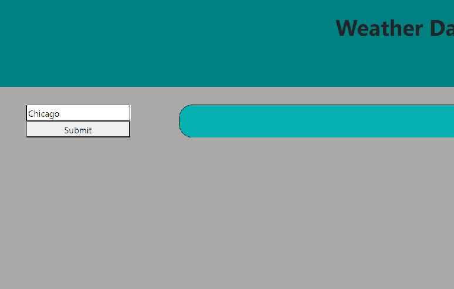
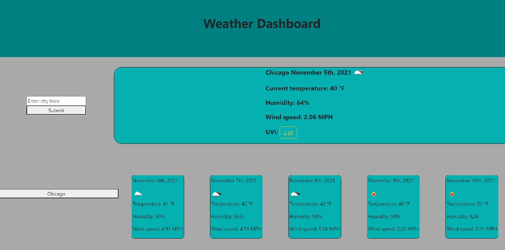
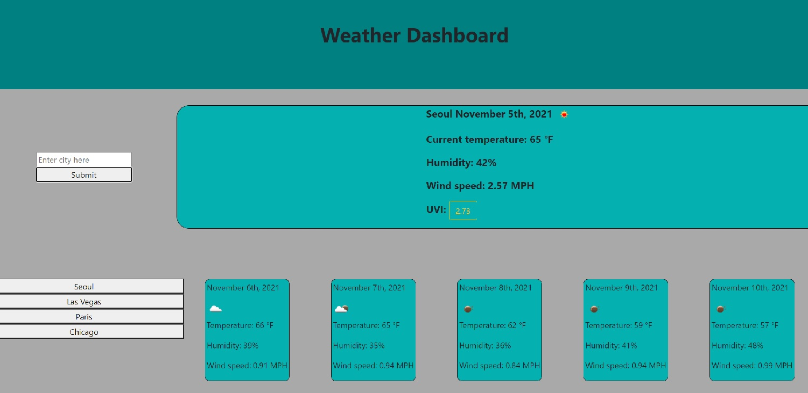
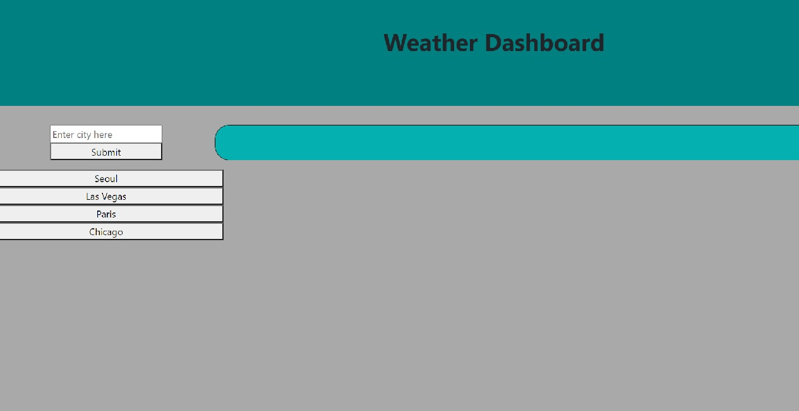
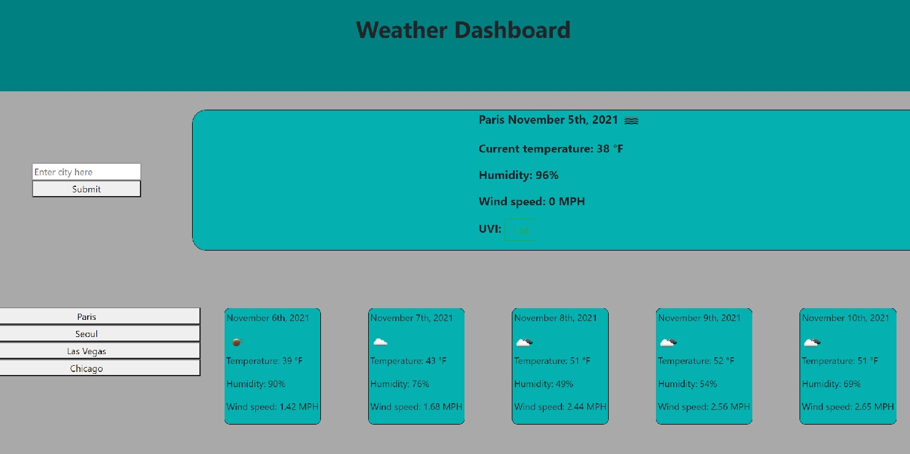

# 06-Homework-WeatherDashboard

## Description

I made a Weather Dashboard.

When the user loads the application, the user is presented with an text input field and a "Submit" button. When the user types in a city into the input field and clicks the "Submit" button, the current weather conditions and a five day forecast is displayed.

The current weather displays: The city name, the current date, an icon representing the current weather, current temperature in farenheit, humidity, wind speed, and the UV index. The UV index's span is colored based on how high the UV index is.

The five day forecast displays five cards with the next five days' weather conditions, including: the date, an icon representing the weather, temperature in farenheit, humidity, and the wind speed.

When a city is searched, a button with the city name is made. This is the user's city search history. The user may look up cities' weather conditions they have searched before with one click.

## Screenshots

## Links

GitHub Repository: [https://github.com/jhur628/05-Homework-WorkDayPlanner](https://github.com/jhur628/05-Homework-WorkDayPlanner)

Deployed Application: [https://jhur628.github.io/05-Homework-WorkDayPlanner/](https://jhur628.github.io/05-Homework-WorkDayPlanner/)

## Other Comments

